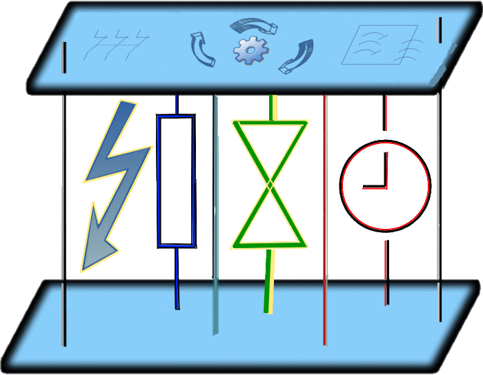
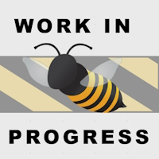

# Thinking in time &thinsp;&mdash;&thinsp; Task as a model, Promise as a value, and Input as a pipe 

See appendices.

> ### Many tailored and most well-known templates/paradigms, such as <samp><b>MVC</b></samp>, <samp><b>MVP</b></samp>, <samp><b>MVVM</b></samp>, <samp><b>MV<i>W</i></b></samp>[hatever], <samp><b>POCO</b></samp>, and custom solutions rest on [models](https://github.com/BYTESHAUS/read-write/blob/main/README%2B/software/design/parts/README+/app-model.md)⬅️. (Which do not?) 
> #### Where developers bind presentations, actions, and messages to values/properties/callbacks. 

<h3 align="center">This approach is productive for rough abstraction and logical division, but oversimplistic and static.</h3>

It treats models as snapped in a moment when every property is known, and their statuses are final: 
as values can be predictably (pre)set/reset, or coded in a time slot, imperceptible to users or insignificant for hardware/software clients. 

<h3 align="center">However</h3>

<table><tr valign="center"><td align="center" width="40%"><picture></picture></td><td>

Domain <b>and</b> IT realities are not always under the best of circumstances and meet:

<ul>
<li>heavy or long calculations, <samp>(heavy isn't always long and vice versa)</samp></li>
<li>lagging network and services,</li>
<li>slow rudimentary storages,</li>
<li>pending answers, scheduled and asynchronous events,</li>
</ul>

and any operation can break, fail, run out of time, or be suspended/canceled/restarted on both sides.

Enough scenarios shall mock delays to catch user attention or show proof of work. For example:
   ⏱️ Saving a giga-document, rebuilding a solution, or making a bank transaction can occur unnaturally instant, leaving users feeling it hasn't run.
   ⏱️ There's a minimum span for a user to understand the pop-up message.

</td></tr></table>

🚧🪡🚧ANOTHER THEME: STREAMING !

> **Modern languages and frameworks grant first-class multitasking and synchronization tools out of the box.
> <mark>Even so</mark>, "classical" prevalent implementation incurs perpetual "async" patching of unpredictable values for a reactive experience.**

Now, spice these reactive _courses_ with `async`: you must break queues of values and orchestrate calls. To make things worse, recall that besides multitasking, there's multi-dispatching (that's how auto-save or spellcheck runs).

Not to forget that the statuses of properties and operations are asynchronous values too.

<table><tr></tr><tr><td>

___<ins>and now the <b><samp>IMPORTANT</samp>&nbsp; T&thinsp;W&thinsp;I&thinsp;S&thinsp;T</b>&nbsp;</ins>❗<b>.&thinsp;.&thinsp;.</b> ___

&nbsp;

<b>Imagine that a user (view) input/action can be a <i>promise</i>.</b>

A bright example is a chess engine waiting most of its time for a player's action. And the chess model (instance of a `game` class) is then ... the&nbsp;<b>VIEW</b>.

We have our picture rotated 180° (or vertically flipped if you prefer). And it's not for fun but for a look beyond the standard patterns.

</td></tr></table>

# Part 2. Re-thinking the Model and presentation

MERMAID for PYRAMID CHG

## What promise is

## What multitasking is

(The same thread)

**Let's cast async means to templates!**

<table><tr valign="top"><td><picture></picture></td><td>

We are on the home stretch now, with a couple of items to close:

  <lu>
    <li>Formliaze.</li>
    <li>Find application.</li>
    <li>Implement.</li>
    <li>Document.</li>
    <li><i>Submit doctoral theses.</i></li>
  </lu>

<b><samp>voilà</samp></b>

</td></tr></table>

> 🚧🐝🚧 <mark><b>... to be WRITTEN when PARTICULAR IMPLEMENTATION comes into play ...</b></mark> 🚧🐝🚧

\___________\
🔚 🌔 <samp>2024-2025 .. <b>Β</b>ytesHausMeister ... 🚧 pending 🚧</samp>
