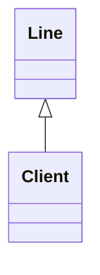

# Techniques &nbsp;&mdash;&nbsp; &Bscr;oilerplate, &Sscr;caffolding, &Wscr;iring ...

NOT ONLY BOILERPLAT but SOUND ! [quality&nbsp;code](https://github.com/BYTESHAUS/read-write/blob/main/README+/software/QA//README+/code-quality.md)

🚧 PLACEHOLDER

### BADGE: DEP-CY INVER -- Collection numbering on demand 🚧

PICTURE OF QUEUE PENDING!!!

<table><tr valign="top"><td width="33%">

Let's imagine a collection and one of its usual "derivatives" - the sequence number of the item. 
  
</td><td width="33%">

  
</td><td width="*">

As an example

</td></tr></table>

DIAGRAM: As real world example, a line to counter where one could inquiry his or her number to evaluate the wait time.

To support this property the following ops required:

+ write number as collection.Length
+ update numbers on delete (FROM to )
+ update numbers on insert (skip tthe line)

  ...

___________\
🌔 2025-2026..
