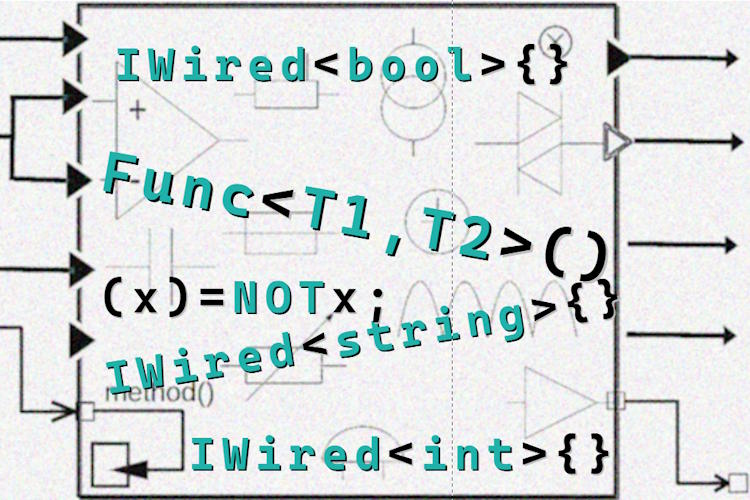

# P<samp>atterns _via_ Techniques:</samp> Object-oriented C<samp>IRCUITRY</samp>

> ### __«C<samp>IRCUITRY</samp>» as an idea is better presented by _inductive reasoning_ &thinsp;&mdash;&thinsp; from a case below.__

<div>Consider a bundle of interlaced "<i>either</i>"-functions:</div>
<div align="right"><sub><i>C#-like pseudo-code for brevity</i></sub></div>

```csharp
class Is {
  string Subject { get; set; }

  bool NullOrEmpty => Subject is null || '' == Subject;
  bool NullOrWhitespace => string.IsNullOrWhiteSpace(Subject);
  bool Ascii { ... };
  bool Latin { ... };
  bool AlphaNumeric { ... };
}

```

... and there's a demand for these functions as **`neither`**.

When there's no magic out-of-the-hat<sup>🪄</sup> _Boolean Inverter_ a predictable realization will be a wrapper:

```csharp
class Not : Is {
  override NullOrEmpty => !NullOrEmpty;
  override NullOrWhitespace => !NullOrWhitespace;
  override Ascii => !Ascii;
  override Latin => !Latin;
  override AlphaNumeric => !AlphaNumeric;
}
```

**But what if** instead of this and other evident "programmatic" realizations, we offer a kind of <samp><mark>&thinsp;declarative plugs&thinsp;</mark></samp>?

```csharp
class Is<Fn> : Is where Fn : Function<bool, bool> {
   override NullOrEmpty => Fn(NullOrEmpty);
   ...
  override AlphaNumeric => Fn(AlphaNumeric);
}

class Not : Is<Invert>;
class Denier : Is<False>;
class Stub : Is<True>;
class Identity : Is<Wire>; // repeats <code>Is</code>

```

This simplest _unary boolean_ has four variants, and with two practical may be a surplus **but** other types with more than one operand will reveal an enormous space of ... 

<h2 align="center">... opportunities, to propose a few:</h2>

### Bring your own function:

<table><tr></tr><tr align="center"><td><b>Template</b></td><td><b>Use</b></td></tr><tr valign="top"><td>
    <code><i>Bag</i> diff&lt;<b><mark>T</mark></b>&gt; = <br />&nbsp &nbsp 
      <mark>T</mark>Compare&lt;T, <mark>Fn</mark>&gt;(<b><mark></mark>T</b> sample, CompareOptions options)</code><br />
&nbsp &nbsp;where,
<ul>
<li><code>Bag</code> collects differences (of possibly different types) as <a href="../../../../src/TuttiFrutti/AbcStructTests/Heaps">collection</a>,</li>
<li><code><b>T</b></code> is the type which instances are extended,</li>
<li><code><b>Fn</b></code> defines a function performing the extension.</li>
  </ul>
</td><td>

```csharp

"yada_yada".Compare<LooseContent>("blah blah");

```

&nbsp &nbsp;where,

`LooseContent` means a compare function that ignores\
whitespace and punctuation 

</td><tr></tr><tr valign="top"><td>

```csharp
N num = MATH_FUNC<ALGORITHM>.Within<N>(from, to);
```

</td><td>

```csharp
int rnd = Random<DiceRole>.Within(1, 6);
```

```csharp
N hash = Hash<FISH>.Within<N>(from, to);
```

</td>
</tr></table>

### Lingua

Alphabet (rules)

```csharp
text.Is<Greek, Latin>.Alphanumeric;
```

## <sup>🪄</sup>Dynamic "Majic Wand"

This must be the most powerful and controversial proposition.

<details><summary><a id="why-circuitry" /><h3><ins>Now the <i>electrical</i> metaphor must have taken shapes&thinsp;</ins>:</h3>&nbsp &nbsp;</summary>

<table><tr valign="top"><td width="40%"><picture></picture></td>
<td>
  <p>You may have already grasped the similarities of the proposed solution to electric and electronic circuits and boards.</p>
  <ul>
  <li><code>Booleans</code> match logic gates .</li>
  <li><code>Numbers</code> &mdash; digital circuits.</li>
   <li><code>string</code> and classes are analogue electronics.</li>
  </ul>
  <p>Generic "markup" is like plugging elements on IO or onto circuits of a functional plate: direct, chaining, cascading, ...</p>

Classes are PLATES to make BOARDS.
  
  <p>And the running code is the current. Great, we are back to the roots (of machine language).</p>
</td>
</tr></table>
</details>

## Wrap up. Pros and Cons

🧩 Both dis- and advantage is that it's an <samp>EXPERIMENTAL</samp> feature.

✅ **First of all**, the split of design in a good way - as a "side" abstraction or a "lane" of logics.

✅It goes hand in hand with generic parametrization.

The main logic flow remains intact.

+ Declarative language is friendlier for comprehension.

TEMPLATING 

+ sharing. impulse of elements. invert, multilingual trim are obvious

declarative is plus

Design-first will create a test structure that is friendly for exploring and introducing applications and features (even for non-developers).

🛑 Overengineering

🗝️🕰️ Implementation Obstacles 

**`C#`** doesn't have `Func` generic constraint to be patched
 (DELETGATE doesn't help)


## Appendix. Implementation cases

* [⭐**ISie**⭐](../../../parts/_ext/ISie/README.md) and WizConstr

___________\
🔚 🌘  <samp>2024-2026..<b>B</b>yteshausMeister</samp>
