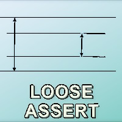

# Prog Tests &nbsp;<samp>&mdash;</samp>&nbsp; _&Lscr;oose `Assert`_ &nbsp;<samp>&mdash;</samp>&nbsp;  Value Tolerance

<table><tr><td>
</td><td>

Known test frameworks support deltas for comparing numbers to expected values, like [`Within`](https://docs.nunit.org/articles/nunit/writing-tests/constraints/EqualConstraint.html)<b>NUnit</b>.
Aside from absolute values, these asserts may specify percent, [ULP](https://en.wikipedia.org/wiki/Unit_in_the_last_place)<b>w</b> or time units.

It's not enough, because deltas may differ for the `+/—` sides of deltas, similar to _engineering fit_. You may also want to specify more elaborate conditions. Covering with a custom function is easy and fast (or even extending the _Assert_) and doesn't merit special attention.
</td></tr></table> 

The challenge is creating cascading attributes for test data, classes, and cases to mark(up) predefined tolerance functions. 
Current implementation supplies only absolute [**`[Precision(_number_)]`**](../../../src/TuttiFrutti/MeasData/Mech/Force/Thrusts.cs) but shall be expanded to markup like:

`[Precision[+0.05, -1%]]`, `[Precision[+0.5.meter, -1.centimeter]]`, [Precision(() => ..._func_you_want_...)]

// ... 🚧 TO IMPLEMENT ...

## Relevant topics
|&thinsp;- [Loosing the `Assert`](tests-loose_assert.md) // umbrella topic\
|&thinsp;-&thinsp;- **Value tolerance interlaces with [gradual assert](tests-gradual_assert.md).**

__________\
🔚 2024-2026.. 🚧 pending 🚧 ...
