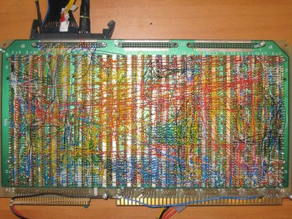

# MVVM - Orchestration of notifications

WPF built-in [DataContext](https://learn.microsoft.com/dotnet/desktop/wpf/data/how-to-specify-the-binding-source) has only to raise `PropertyChanged`<sup>:raising_hand:</sup> with the name of item, which value bound elements must re-evaluate.\
&nbsp;&nbsp;&nbsp;&nbsp;<sup>:raising_hand:</sup>&nbsp;<sub>'Changed' deceives, since it's most but not the only cause of the event.</sub>

You must already know and use fast and easy [Microsoft recipe](https://learn.microsoft.com/en-us/dotnet/desktop/wpf/data/how-to-implement-property-change-notification): `set {field = value; OnPropertyChanged();}`. It's enough for flat easy forms but on the path of the true developer there're:
+ tied and calculated values,
+ groups and hierarchies of cross-dependent ViewModels, 
+ need for reuse of notification logic,
+ diverse notifications mechanism (not only PropertyChanged)

And then if a ViewModel were printed on a board it would look:\
\
(*Found on bigmessowires.com*)

## Proposal 

Another snapshot from the same site must give the cue.\


"Chips" shall encapsulate notification logic with some calls. It's a matter of taste how they will be implemented, for example, either injection or inheritance from:

```csharp
interface IOrchestrating {
   void Notify([CallerMemberName]string caller="<n/a>");
   void MassNotify();
}
```

Beyond the order, such an approach will bring the next possibilities:
+ optimization (e.g. black out notifications for hidden UI parts)
+ easy swap of notification model
+ hooks for tracing, logging, etc.

## Commands and messages

Organization of [WPF commands](https://learn.microsoft.com/en-us/dotnet/desktop/wpf/advanced/commanding-overview) may follow the same model, but they are easier and it's enough to pack commands in corresponding sub-ViewModels, while `CanExecute` properties may be orchestrated.

MVVM messaging, either custom or out-of-the-box, is based on properties.

## Irrelevant tasks

There're other tools to improve notification but they aren't orchestration:

+ Everithing that [ReactiveX](https://reactivex.io/) can do.
+ Any wiring on the View side.

